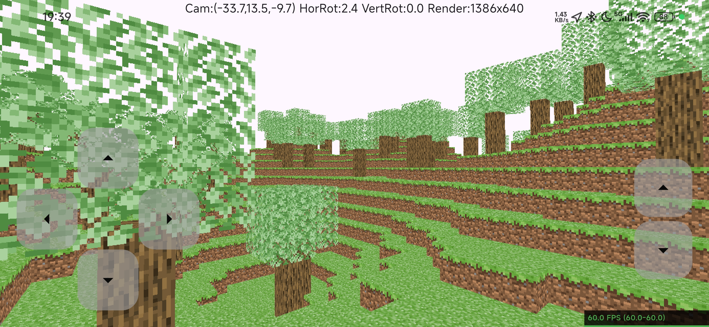

# flutter-mc

A Minecraft-like game demo using Flutter GPU API.

**Note: need impeller backend** (windows unavailable now)

# feature
- different types of blocks
- chunk-based
- terrain generation
- face culling
- Blinn phong lighting

# known issue

[FlutterGPU OOM issue on Android](https://github.com/flutter/flutter/issues/172068) was recently fixed but not yet available on the beta channel.
